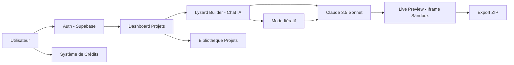
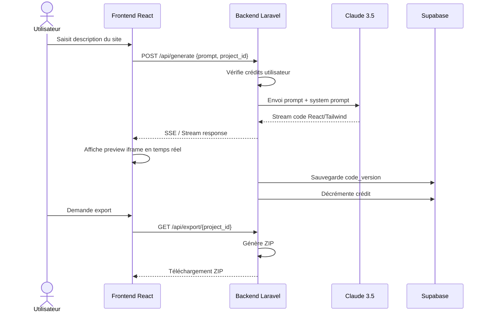

# 📋 Analyse Fonctionnelle — Lyzard.ai

## 1. Vision Produit

**Lyzard.ai** est une plateforme **"Text-to-Site"** SaaS permettant de générer des Landing Pages professionnelles (React/Tailwind) à partir d'une simple description textuelle, en moins de 30 secondes.

## 2. Personas Cibles

| Persona | Besoin | Valeur Lyzard |
|---|---|---|
| **Entrepreneur non-tech** | Créer un site vitrine sans développeur | Zéro code, résultat pro en 30s |
| **Freelancer / Consultant** | Landing pages rapides pour clients | Itération rapide, export code |
| **Étudiant / Porteur de projet** | MVP visuel pour pitch | Gratuit (3 crédits), multi-langue |
| **Marketeur digital** | Pages d'atterrissage A/B testing | Génération multiples, export ZIP |

## 3. Cartographie Fonctionnelle

## 4. Modules Fonctionnels

### 4.1 — Authentification & Comptes
- Login / Signup (Email+Password ou Google OAuth)
- JWT géré par Supabase Auth
- Profil utilisateur avec solde de crédits

### 4.2 — Lyzard Builder (Chat IA)
- **Prompt intelligent** : Champ de saisie multi-langue (Darija inclus)
- **Streaming de code** : Affichage progressif de la génération
- **Live Preview** : Rendu iframe sandbox en temps réel
- **Mode itératif** : Modification ciblée via conversation IA

### 4.3 — Gestion des Projets
- Dashboard (bibliothèque de tous les projets)
- Auto-save en base de données
- Historique de versions (undo)
- Export ZIP (index.html, script.js, tailwind.config)

### 4.4 — Système de Crédits
- 3 générations gratuites à l'inscription
- Achat de crédits supplémentaires
- Décompte à chaque génération

## 5. Règles Métier

| Règle | Description |
|---|---|
| **R1** | Les clés API (Anthropic/Supabase) ne transitent JAMAIS côté client |
| **R2** | Chaque génération consomme 1 crédit |
| **R3** | Un projet a N versions de code (versioning) |
| **R4** | L'export ZIP contient : `index.html`, `script.js`, `tailwind.config` |
| **R5** | Le streaming affiche l'avancement en temps réel |
| **R6** | Le System Prompt IA doit rester court et précis (performance) |

## 6. Flux Utilisateur Principal

