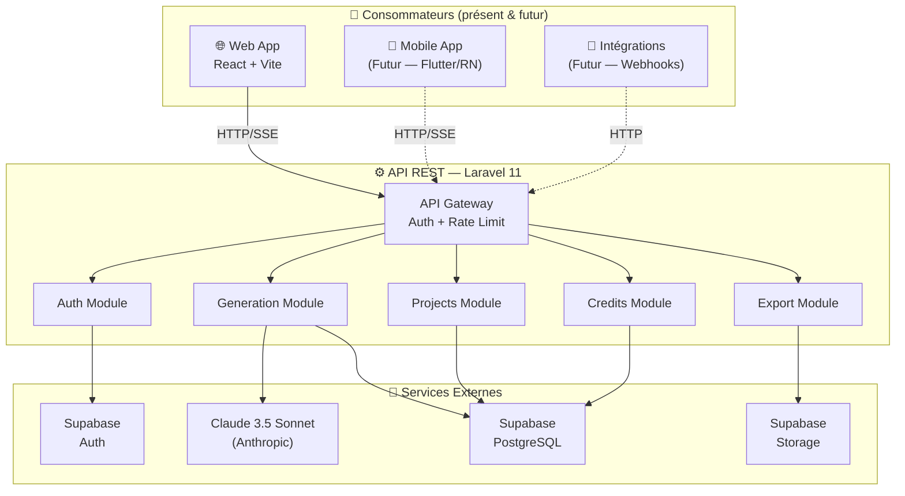
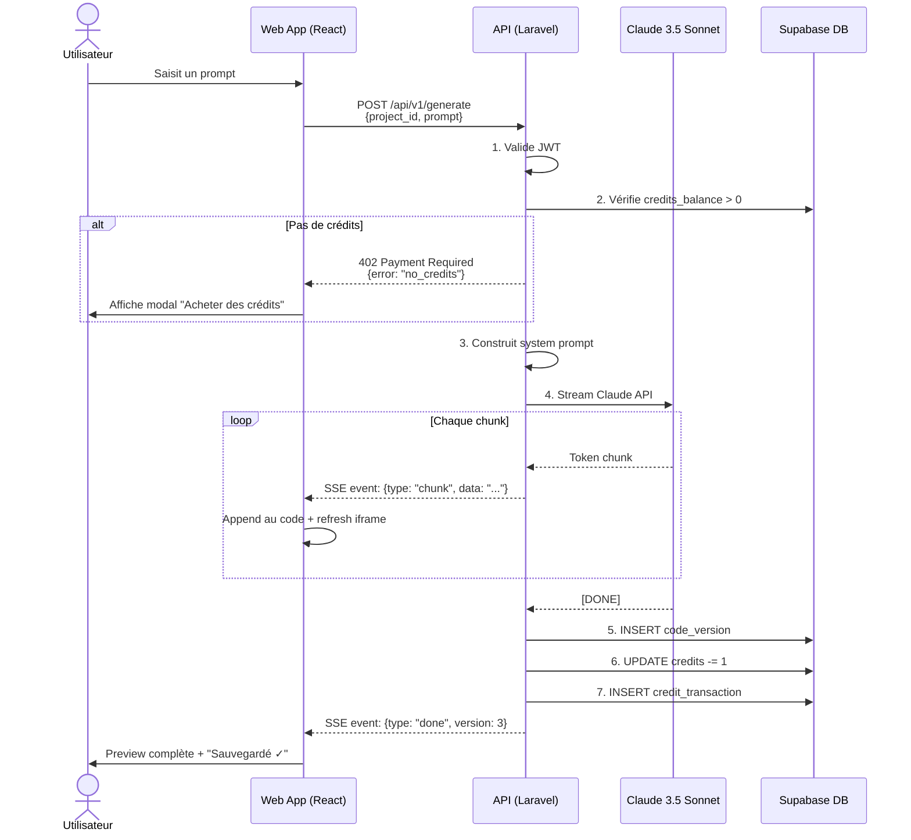

# 🏗️ Architecture Technique — Lyzard.ai (API-First)

> **Principe clé** : L'API est un produit indépendant. Le Web App est un *consommateur* de l'API, tout comme une future app mobile le sera.

## 1. Architecture API-First — Vue d'Ensemble



### Pourquoi API-First ?

| Avantage | Explication |
|---|---|
| **Mobile-ready** | La même API servira une app Flutter/React Native sans rien changer |
| **Séparation claire** | L'API ne sait rien du client → testable, maintenable |
| **Scalabilité** | API et Web App se déploient et scalent indépendamment |
| **Sécurité** | Un seul point d'entrée à sécuriser (l'API) |

---

## 2. Les 3 Couches

```
┌─────────────────────────────────────────────────┐
│  COUCHE 1 : API (Laravel 11)                    │
│  ─ Logique métier, Auth, Claude, Crédits        │
│  ─ Pas de HTML, pas de vues, JUSTE du JSON/SSE  │
│  ─ Repo : lyzard-api                            │
├─────────────────────────────────────────────────┤
│  COUCHE 2 : WEB APP (React + Vite)              │
│  ─ Interface utilisateur, Preview Engine         │
│  ─ Consomme l'API via HTTP                      │
│  ─ Repo : lyzard-web                            │
├─────────────────────────────────────────────────┤
│  COUCHE 3 : MOBILE APP (Futur)                  │
│  ─ Flutter ou React Native                      │
│  ─ Consomme la MÊME API                         │
│  ─ Repo : lyzard-mobile (futur)                 │
└─────────────────────────────────────────────────┘
```

---

## 3. API Specification Complète

### Auth

| Méthode | Route | Body / Params | Response | Auth |
|---|---|---|---|---|
| `POST` | `/api/v1/auth/register` | `{name, email, password}` | `{user, token}` | ❌ |
| `POST` | `/api/v1/auth/login` | `{email, password}` | `{user, token}` | ❌ |
| `POST` | `/api/v1/auth/google` | `{google_token}` | `{user, token}` | ❌ |
| `POST` | `/api/v1/auth/logout` | — | `204 No Content` | ✅ |
| `POST` | `/api/v1/auth/refresh` | `{refresh_token}` | `{token}` | ❌ |

### User

| Méthode | Route | Body / Params | Response | Auth |
|---|---|---|---|---|
| `GET` | `/api/v1/user/me` | — | `{id, name, email, credits_balance, avatar_url}` | ✅ |
| `PATCH` | `/api/v1/user/me` | `{name?, avatar_url?}` | `{user}` | ✅ |

### Projects

| Méthode | Route | Body / Params | Response | Auth |
|---|---|---|---|---|
| `GET` | `/api/v1/projects` | `?page=1&per_page=12` | `{data: [Project], meta: {total, page}}` | ✅ |
| `POST` | `/api/v1/projects` | `{title?, description?}` | `{project}` | ✅ |
| `GET` | `/api/v1/projects/{id}` | — | `{project, current_version}` | ✅ |
| `PATCH` | `/api/v1/projects/{id}` | `{title?, description?}` | `{project}` | ✅ |
| `DELETE` | `/api/v1/projects/{id}` | — | `204 No Content` | ✅ |
| `GET` | `/api/v1/projects/{id}/versions` | — | `[{version_number, prompt_used, created_at}]` | ✅ |
| `POST` | `/api/v1/projects/{id}/restore/{version}` | — | `{project, restored_version}` | ✅ |

### Generation

| Méthode | Route | Body / Params | Response | Auth |
|---|---|---|---|---|
| `POST` | `/api/v1/generate` | `{project_id, prompt}` | SSE stream → `{html_code, version}` | ✅ |
| `POST` | `/api/v1/generate/iterate` | `{project_id, prompt, section?}` | SSE stream → `{html_code, version}` | ✅ |

### Export

| Méthode | Route | Body / Params | Response | Auth |
|---|---|---|---|---|
| `POST` | `/api/v1/projects/{id}/export` | — | `{download_url, expires_at}` | ✅ |

### Credits

| Méthode | Route | Body / Params | Response | Auth |
|---|---|---|---|---|
| `GET` | `/api/v1/credits` | — | `{balance, transactions: [...]}` | ✅ |
| `POST` | `/api/v1/credits/purchase` | `{package: "10"|"50"|"100"}` | `{new_balance, transaction}` | ✅ |

> **Versioning** : Toutes les routes sont préfixées `/api/v1/` pour permettre une v2 future sans casser les clients existants.

---

## 4. Flux de Données — Génération IA



---

## 5. Réponses API — Format Standard

Toutes les réponses suivent un format uniforme (facilite l'intégration mobile future) :

### Succès

```json
{
  "success": true,
  "data": { ... },
  "meta": {
    "page": 1,
    "per_page": 12,
    "total": 42
  }
}
```

### Erreur

```json
{
  "success": false,
  "error": {
    "code": "no_credits",
    "message": "Votre solde de crédits est épuisé.",
    "status": 402
  }
}
```

### SSE Stream (Génération)

```
event: chunk
data: {"type":"chunk","content":"<div class=\"bg-gradient-to-r..."}

event: chunk
data: {"type":"chunk","content":"from-purple-500 to-blue-600..."}

event: done
data: {"type":"done","version_number":3,"credits_remaining":2}

event: error
data: {"type":"error","code":"generation_failed","message":"..."}
```

---

## 6. Middleware Pipeline

```
Requête HTTP
  │
  ▼
┌──────────────┐
│ CORS         │ ← Origines autorisées (web + futur mobile)
├──────────────┤
│ Rate Limit   │ ← 60 req/min global, 5 req/min sur /generate
├──────────────┤
│ Auth JWT     │ ← Valide le token Supabase
├──────────────┤
│ Check Credits│ ← Seulement sur /generate (vérifie solde > 0)
├──────────────┤
│ Sanitize     │ ← Nettoie les entrées (XSS, injection)
├──────────────┤
│ Controller   │ ← Logique métier
└──────────────┘
```

---

## 7. Stack Résumé

| Composant | Tech | Déploiement |
|---|---|---|
| **API** | Laravel 11, PHP 8.3 | DigitalOcean / Railway / Render |
| **Web App** | React 18, Vite, Tailwind CSS | Vercel |
| **Database** | PostgreSQL via Supabase | Supabase Cloud |
| **Auth** | Supabase Auth (JWT) | Supabase Cloud |
| **Storage** | Supabase Storage | Supabase Cloud |
| **IA** | Claude 3.5 Sonnet | Anthropic API |
| **Mobile (futur)** | Flutter / React Native | App Store + Play Store |
