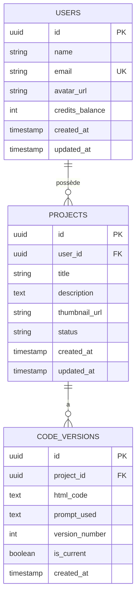
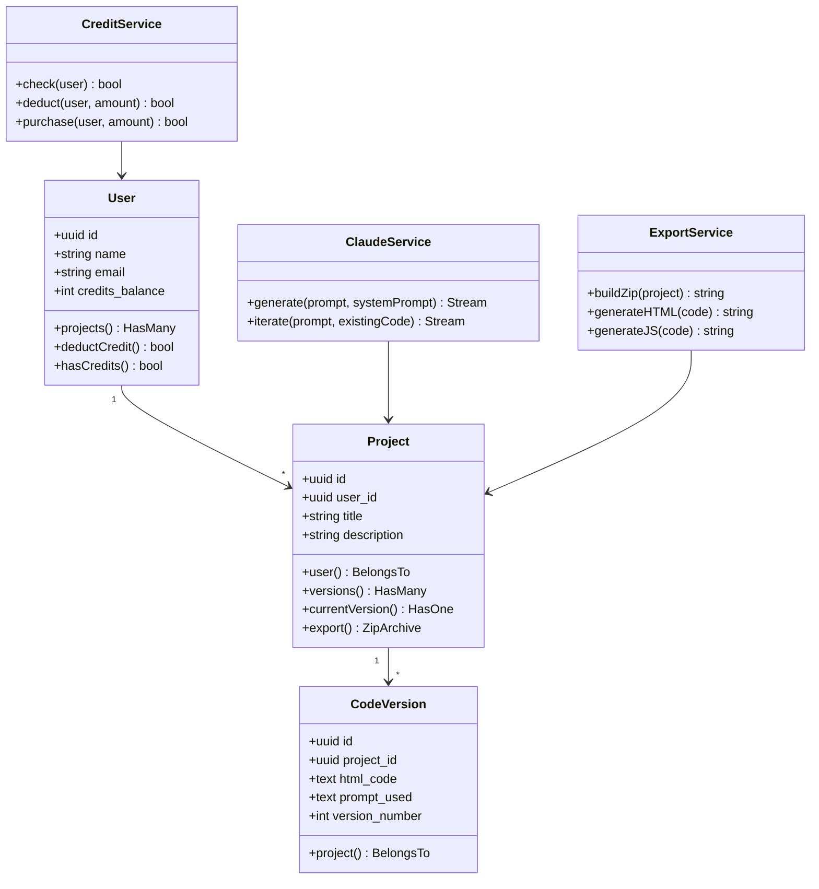

# 🗃️ Conception & Modèle de Données — Lyzard.ai

## 1. Modèle Entité-Relation



## 2. Scripts SQL (Supabase / PostgreSQL)

### Table `users` (profiles)

```sql
CREATE TABLE public.profiles (
    id UUID PRIMARY KEY REFERENCES auth.users(id) ON DELETE CASCADE,
    name VARCHAR(255) NOT NULL,
    email VARCHAR(255) UNIQUE NOT NULL,
    avatar_url TEXT,
    credits_balance INTEGER DEFAULT 3 NOT NULL CHECK (credits_balance >= 0),
    created_at TIMESTAMPTZ DEFAULT NOW(),
    updated_at TIMESTAMPTZ DEFAULT NOW()
);

-- RLS Policy : chaque user ne voit que son propre profil
ALTER TABLE public.profiles ENABLE ROW LEVEL SECURITY;
CREATE POLICY "Users can view own profile"
    ON public.profiles FOR SELECT
    USING (auth.uid() = id);
CREATE POLICY "Users can update own profile"
    ON public.profiles FOR UPDATE
    USING (auth.uid() = id);
```

### Table `projects`

```sql
CREATE TABLE public.projects (
    id UUID PRIMARY KEY DEFAULT gen_random_uuid(),
    user_id UUID NOT NULL REFERENCES public.profiles(id) ON DELETE CASCADE,
    title VARCHAR(255) NOT NULL DEFAULT 'Sans titre',
    description TEXT,
    thumbnail_url TEXT,
    status VARCHAR(50) DEFAULT 'draft' CHECK (status IN ('draft', 'published', 'archived')),
    created_at TIMESTAMPTZ DEFAULT NOW(),
    updated_at TIMESTAMPTZ DEFAULT NOW()
);

CREATE INDEX idx_projects_user_id ON public.projects(user_id);

ALTER TABLE public.projects ENABLE ROW LEVEL SECURITY;
CREATE POLICY "Users can CRUD own projects"
    ON public.projects FOR ALL
    USING (auth.uid() = user_id);
```

### Table `code_versions`

```sql
CREATE TABLE public.code_versions (
    id UUID PRIMARY KEY DEFAULT gen_random_uuid(),
    project_id UUID NOT NULL REFERENCES public.projects(id) ON DELETE CASCADE,
    html_code TEXT NOT NULL,
    prompt_used TEXT NOT NULL,
    version_number INTEGER NOT NULL DEFAULT 1,
    is_current BOOLEAN DEFAULT TRUE,
    created_at TIMESTAMPTZ DEFAULT NOW()
);

CREATE INDEX idx_code_versions_project ON public.code_versions(project_id);
CREATE UNIQUE INDEX idx_unique_version ON public.code_versions(project_id, version_number);

-- Trigger : marquer les anciennes versions comme non-current
CREATE OR REPLACE FUNCTION set_previous_versions_not_current()
RETURNS TRIGGER AS $$
BEGIN
    UPDATE public.code_versions
    SET is_current = FALSE
    WHERE project_id = NEW.project_id AND id != NEW.id;
    RETURN NEW;
END;
$$ LANGUAGE plpgsql;

CREATE TRIGGER trg_version_current
    AFTER INSERT ON public.code_versions
    FOR EACH ROW EXECUTE FUNCTION set_previous_versions_not_current();
```

### Table `credit_transactions` (optionnelle, traçabilité)

```sql
CREATE TABLE public.credit_transactions (
    id UUID PRIMARY KEY DEFAULT gen_random_uuid(),
    user_id UUID NOT NULL REFERENCES public.profiles(id),
    amount INTEGER NOT NULL,  -- positif = achat, négatif = consommation
    type VARCHAR(50) NOT NULL CHECK (type IN ('generation', 'purchase', 'bonus')),
    description TEXT,
    created_at TIMESTAMPTZ DEFAULT NOW()
);

CREATE INDEX idx_credit_tx_user ON public.credit_transactions(user_id);
```

## 3. Diagramme de Classes (Backend Laravel)



## 4. Design Patterns Utilisés

| Pattern | Usage |
|---|---|
| **Service Layer** | `ClaudeService`, `ExportService`, `CreditService` séparés des controllers |
| **Repository** | Eloquent ORM comme couche d'accès données |
| **Observer/Events** | Trigger SQL pour la gestion des versions courantes |
| **Strategy** | System Prompts adaptatifs selon la langue/type de site |
| **Streaming** | SSE (Server-Sent Events) pour le flux de génération |
