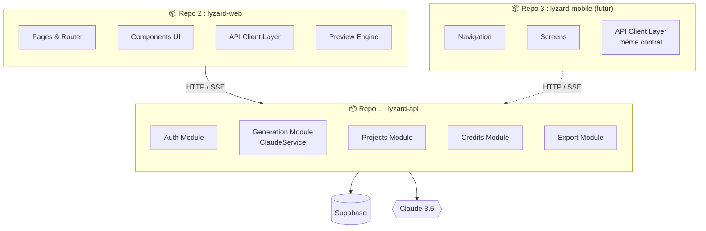

# 🧩 Division des Applications — Lyzard.ai (API-First)

> **Principe** : 3 repos indépendants. L'API est le produit central. Les clients (Web, Mobile) sont des consommateurs interchangeables.

---

## 1. Vue d'Ensemble — 3 Repos



### Règle d'or

> L'API ne retourne **JAMAIS** de HTML. Uniquement du **JSON** et du **SSE**.
> Le Web App ne contacte **JAMAIS** Supabase ou Claude directement.

---

## 2. Repo API : `lyzard-api`

**Tech** : Laravel 11, PHP 8.3
**Responsabilités** : Toute la logique métier, sécurité, orchestration IA

### Structure

```
lyzard-api/
├── app/
│   ├── Http/
│   │   ├── Controllers/
│   │   │   └── Api/
│   │   │       └── V1/                        # Versionné
│   │   │           ├── AuthController.php
│   │   │           ├── UserController.php
│   │   │           ├── ProjectController.php
│   │   │           ├── GenerateController.php
│   │   │           ├── ExportController.php
│   │   │           └── CreditController.php
│   │   ├── Middleware/
│   │   │   ├── SupabaseAuth.php               # Valide JWT
│   │   │   ├── CheckCredits.php               # Vérifie solde
│   │   │   ├── RateLimitGeneration.php        # 5/min sur generate
│   │   │   └── ForceJsonResponse.php          # API = JSON only
│   │   ├── Requests/
│   │   │   ├── GenerateRequest.php
│   │   │   ├── IterateRequest.php
│   │   │   └── PurchaseCreditsRequest.php
│   │   └── Resources/                         # Transformers JSON
│   │       ├── ProjectResource.php
│   │       ├── ProjectCollection.php
│   │       ├── UserResource.php
│   │       ├── VersionResource.php
│   │       └── CreditResource.php
│   ├── Models/
│   │   ├── User.php
│   │   ├── Project.php
│   │   ├── CodeVersion.php
│   │   └── CreditTransaction.php
│   ├── Services/
│   │   ├── AI/
│   │   │   ├── ClaudeService.php              # Streaming API Anthropic
│   │   │   ├── PromptBuilder.php              # Compose system prompts
│   │   │   └── LanguageDetector.php           # Détecte FR/EN/Darija
│   │   ├── Export/
│   │   │   └── ZipExportService.php           # Génère ZIP
│   │   └── Credits/
│   │       └── CreditManager.php              # Vérifie/déduit/achète
│   ├── Events/
│   │   ├── GenerationCompleted.php
│   │   └── CreditDeducted.php
│   └── Exceptions/
│       ├── InsufficientCreditsException.php
│       ├── GenerationFailedException.php
│       └── Handler.php                        # Format erreurs uniforme
├── config/
│   ├── anthropic.php
│   └── credits.php                            # DEFAULT_CREDITS, COST
├── routes/
│   └── api.php                                # Toutes les routes v1
├── database/
│   └── migrations/
├── tests/
│   ├── Feature/
│   │   ├── Auth/
│   │   │   ├── RegisterTest.php
│   │   │   └── LoginTest.php
│   │   ├── Projects/
│   │   │   ├── CreateProjectTest.php
│   │   │   ├── ListProjectsTest.php
│   │   │   └── DeleteProjectTest.php
│   │   ├── Generate/
│   │   │   ├── GeneratePageTest.php
│   │   │   └── IteratePageTest.php
│   │   └── Credits/
│   │       ├── DeductCreditTest.php
│   │       └── PurchaseCreditTest.php
│   └── Unit/
│       ├── ClaudeServiceTest.php
│       ├── PromptBuilderTest.php
│       ├── CreditManagerTest.php
│       └── ZipExportServiceTest.php
├── .env.example
├── composer.json
└── README.md
```

### Routes (`routes/api.php`)

```php
Route::prefix('v1')->group(function () {

    // Public
    Route::prefix('auth')->group(function () {
        Route::post('/register', [AuthController::class, 'register']);
        Route::post('/login', [AuthController::class, 'login']);
        Route::post('/google', [AuthController::class, 'google']);
        Route::post('/refresh', [AuthController::class, 'refresh']);
    });

    // Authenticated
    Route::middleware(['supabase.auth', 'force.json'])->group(function () {

        Route::post('/auth/logout', [AuthController::class, 'logout']);

        // User
        Route::get('/user/me', [UserController::class, 'show']);
        Route::patch('/user/me', [UserController::class, 'update']);

        // Projects
        Route::apiResource('/projects', ProjectController::class);
        Route::get('/projects/{project}/versions', [ProjectController::class, 'versions']);
        Route::post('/projects/{project}/restore/{version}', [ProjectController::class, 'restore']);

        // Generation (requires credits)
        Route::middleware(['check.credits', 'throttle:generation'])->group(function () {
            Route::post('/generate', [GenerateController::class, 'generate']);
            Route::post('/generate/iterate', [GenerateController::class, 'iterate']);
        });

        // Export
        Route::post('/projects/{project}/export', [ExportController::class, 'export']);

        // Credits
        Route::get('/credits', [CreditController::class, 'index']);
        Route::post('/credits/purchase', [CreditController::class, 'purchase']);
    });
});
```

### .env (API)

```env
APP_NAME=LyzardAPI
APP_ENV=production
APP_URL=https://api.lyzard.ai

# Supabase
SUPABASE_URL=https://xxx.supabase.co
SUPABASE_ANON_KEY=eyJ...
SUPABASE_SERVICE_KEY=eyJ...   # ← Seulement ici, JAMAIS côté client

# Anthropic
ANTHROPIC_API_KEY=sk-ant-...
ANTHROPIC_MODEL=claude-3-5-sonnet-20241022

# Credits
DEFAULT_CREDITS=3
GENERATION_COST=1

# Rate Limiting
GENERATION_RATE_LIMIT=5        # par minute par user
GLOBAL_RATE_LIMIT=60           # par minute par user

# CORS
CORS_ALLOWED_ORIGINS=https://lyzard.ai,http://localhost:5173
```

---

## 3. Repo Web : `lyzard-web`

**Tech** : React 18, Vite, Tailwind CSS, React Router, Zustand
**Responsabilités** : Interface utilisateur, preview, UX — c'est un *client léger*

### Structure

```
lyzard-web/
├── src/
│   ├── api/                           # Couche communication API
│   │   ├── client.js                  # Axios instance + interceptors
│   │   ├── authApi.js                 # login, register, google, logout
│   │   ├── projectApi.js             # CRUD projects, versions
│   │   ├── generateApi.js            # SSE streaming generation
│   │   ├── creditApi.js              # balance, purchase
│   │   └── exportApi.js              # trigger export, download
│   │
│   ├── components/
│   │   ├── auth/
│   │   │   ├── LoginForm.jsx
│   │   │   ├── SignupForm.jsx
│   │   │   ├── GoogleAuthButton.jsx
│   │   │   └── ProtectedRoute.jsx
│   │   ├── builder/
│   │   │   ├── BuilderLayout.jsx      # Split panel container
│   │   │   ├── ChatPanel.jsx
│   │   │   ├── ChatInput.jsx
│   │   │   ├── ChatMessage.jsx
│   │   │   ├── StreamIndicator.jsx    # Animation streaming
│   │   │   ├── PreviewPanel.jsx
│   │   │   ├── PreviewIframe.jsx      # Sandbox iframe
│   │   │   ├── DeviceSwitcher.jsx     # Desktop/Tablet/Mobile
│   │   │   └── VersionSelector.jsx
│   │   ├── dashboard/
│   │   │   ├── ProjectGrid.jsx
│   │   │   ├── ProjectCard.jsx
│   │   │   ├── EmptyState.jsx
│   │   │   └── NewProjectDialog.jsx
│   │   ├── credits/
│   │   │   ├── CreditBadge.jsx
│   │   │   ├── CreditAlert.jsx
│   │   │   └── PurchaseModal.jsx
│   │   ├── layout/
│   │   │   ├── AppShell.jsx           # Layout wrapper
│   │   │   ├── Navbar.jsx
│   │   │   └── Footer.jsx
│   │   └── ui/                        # Design system primitifs
│   │       ├── Button.jsx
│   │       ├── Input.jsx
│   │       ├── Card.jsx
│   │       ├── Modal.jsx
│   │       ├── Badge.jsx
│   │       ├── Spinner.jsx
│   │       └── Toast.jsx
│   │
│   ├── pages/
│   │   ├── LandingPage.jsx
│   │   ├── LoginPage.jsx
│   │   ├── SignupPage.jsx
│   │   ├── DashboardPage.jsx
│   │   ├── BuilderPage.jsx
│   │   └── SettingsPage.jsx
│   │
│   ├── hooks/
│   │   ├── useAuth.js
│   │   ├── useProjects.js
│   │   ├── useCredits.js
│   │   ├── useSSEStream.js            # Hook SSE générique
│   │   └── useDebounce.js
│   │
│   ├── store/                         # Zustand
│   │   ├── authStore.js
│   │   ├── projectStore.js
│   │   └── builderStore.js
│   │
│   ├── utils/
│   │   ├── constants.js
│   │   └── formatters.js
│   │
│   ├── App.jsx
│   ├── router.jsx
│   └── main.jsx
│
├── public/
│   ├── favicon.ico
│   ├── og-image.png
│   ├── robots.txt
│   └── sitemap.xml
│
├── index.html
├── tailwind.config.js
├── vite.config.js
├── .env.example
├── package.json
└── README.md
```

### .env (Web)

```env
VITE_API_URL=https://api.lyzard.ai/api/v1
VITE_APP_NAME=Lyzard.ai
VITE_SUPABASE_URL=https://xxx.supabase.co
VITE_SUPABASE_ANON_KEY=eyJ...    # Anon key only (public, safe)
```

> ⚠️ **Zéro clé secrète ici.** L'anon key Supabase est publique par design (RLS la protège).

### API Client (`src/api/client.js`)

```javascript
import axios from 'axios';
import { useAuthStore } from '../store/authStore';

const client = axios.create({
  baseURL: import.meta.env.VITE_API_URL,
  headers: { 'Content-Type': 'application/json' },
});

// Inject JWT on every request
client.interceptors.request.use((config) => {
  const token = useAuthStore.getState().token;
  if (token) config.headers.Authorization = `Bearer ${token}`;
  return config;
});

// Handle 401 → redirect to login
client.interceptors.response.use(
  (res) => res.data,
  (err) => {
    if (err.response?.status === 401) {
      useAuthStore.getState().logout();
      window.location.href = '/login';
    }
    return Promise.reject(err.response?.data?.error || err);
  }
);

export default client;
```

---

## 4. Futur Repo Mobile : `lyzard-mobile`

> **Pas à construire maintenant** — mais l'API est déjà prête.

```
lyzard-mobile/               # Flutter ou React Native
├── lib/
│   ├── api/
│   │   └── lyzard_client.dart    # Même contrat HTTP que le web
│   ├── screens/
│   │   ├── login_screen.dart
│   │   ├── dashboard_screen.dart
│   │   └── builder_screen.dart
│   └── models/
│       ├── project.dart
│       └── user.dart
└── pubspec.yaml
```

Le mobile consommera les **mêmes endpoints** `/api/v1/*` sans aucune modification API. Il suffira d'ajouter son origine dans `CORS_ALLOWED_ORIGINS`.

---

## 5. Matrice de Responsabilités

| Ce qui touche... | Repo |
|---|---|
| Logique métier (crédits, génération, export) | `lyzard-api` |
| Clés API secrètes (Anthropic, Supabase Service) | `lyzard-api` |
| Validation des données | `lyzard-api` |
| Sécurité (auth, rate limit, sanitize) | `lyzard-api` |
| Interface utilisateur | `lyzard-web` |
| Preview iframe sandbox | `lyzard-web` |
| Streaming SSE (réception + affichage) | `lyzard-web` |
| SEO (meta tags, robots.txt) | `lyzard-web` |

---

## 6. Contrat d'Intégration

Pour que Fayssal (API) et le Binôme (Web) travaillent en parallèle :

1. **Fayssal écrit** un fichier `api-contract.md` avec chaque endpoint, ses entrées/sorties exactes
2. **Le Binôme crée** des mocks dans `src/api/__mocks__/` pour développer sans attendre l'API
3. **Point de sync** : chaque fin de sprint, valider que le contrat est respecté

```
// Exemple mock pour développer le dashboard sans API
export const mockProjects = [
  {
    id: "uuid-1",
    title: "Mon Restaurant",
    description: "Site vitrine restaurant marocain",
    thumbnail_url: "https://placehold.co/400x300",
    status: "draft",
    created_at: "2026-03-28T10:00:00Z"
  },
  // ...
];
```
